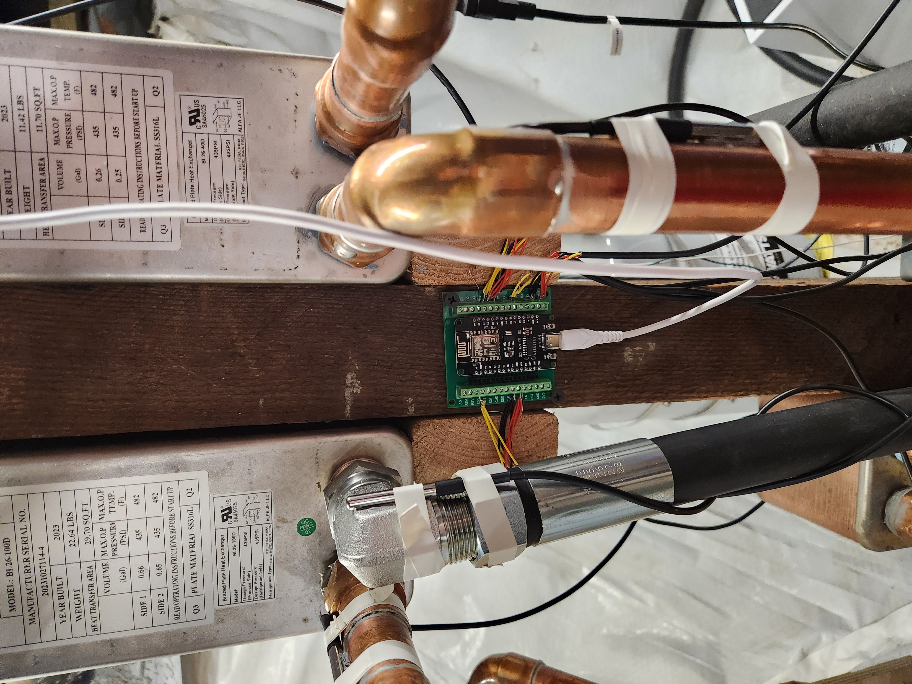

# I heat my 100 yr old home with Bitcoin Mining

This journey started in November of 2023.  This house is almost a century old and was heated a hydronic boiler and radiator system.  For those that aren't familiar, a hydronic radiator system is one that pumps hot water around pipes throughout the house, to let heat off from cast iron radiators.  The system I had/have works great, but I couldn't help being annoyed a burning oil, to only get heat.  

Bitcoin mining machines get hot.  Very hot.  Hot enough to heat a whole home.  The goal of this project was to eliminate my heating oil bill by capturing and reusing the waste heat from these machines.  

## Hydronic Systems

Hydronic Systems are an older technology that holds up incredibly well.  Its efficient, quiet, and a nice cozy heat.  

There are 5 parts to every hydronic system:
1. Heat source(s)
2. Pipes containing water
3. Radiators in the spaces you want heat
4. Pump(s) to circulate the water
5. Thermostats/aquastats, for control and safety
6. (Optional, but nice) Zone controllers for more control

The system is filled with tap water, and that water will forever circulate around until it is drained.  

As for the heat source, it can be anything that gets hot.

Common heat sources include:
* Natual gas boilers
* Oil Boilers
* Wood systems
* (Now) Bitcoin Miners

## The Calculations

### Heat 
The existing oil boiler can produce about 125,000 BTU/h of heat.  This was my rough ballpark number.  However, this current system runs intermittently.  So it would run for about 15 minutes, stop for 30, and repeat.  While this works fine, the temperature swings 5-8 degree (F) between heating cycles.  

There exists a direct conversion of Watts to BTUs: 

    1 Watt = 3.41 BTU/h

So with this number in mind, I began to look at machines on the market and what power they output.  I ended up with two S19k Pros for their increased efficiency and constraints within my budget.  

When running in standard mode, one machine will consume ~2760W from the wall, which is ~9,411 BTU/h of heat; and when running overclocked, one machine pulls ~3600W, which is ~12,276 BTU/h of heat.  Because of thermodynamics, all energy consumed by the processor will eventually be dissipated as heat.  

So since I now knew I had a range of ~18,000 - 24,000 BTUs of heat, is this enough to heat a home?  Turns out, yes.

As shown by these graphs, even though the boiler can produce a much higher output, the short bursts of that output give a similar area under the curve to the miners, which are on all the time when in heating mode.

### Fiat Costs

The oil plan I used to have was an annual usage, divided by 12, and then paid monthly.  So in winter, when more deliveries would come in, I would pay the same as I would in the summer, when I would get maybe 1 a season.  So the negative cost I needed to match or beat was ~$380 per month.  I felt that even if I was "losing" a net of $380 per month, then this project would still be worth it, as I am now at least stacking sats and learning by doing.  

Mining at home will be entirely dependant on your electricity rates.  These rates consist of a generation charge and a distribution charge.  Most commonly refer to this in the combined form as "Cost per Killawatt Hour" or c/kWh.  My distribution charge of 0.08386c/kWh was fixed, nothing I could do to lower it.  However, I was able to find a way to bring my generation charge down to 0.07c/kWh.  So my current electricity rate is $0.154c/kWh.  If you are familiar with the mining scene, this is quite high.  But recapturing the heat is an incredibly efficient action.  What was waste is now useful, while getting Sats.  It's paying once, and receiving two uses for the same watt.  This efficiency boost allows home mining operations to be competitive with commercial.  Heating is a sunk cost for a home, and now it is possible to monetize it.  

Remember, **the goal is not "profit" in fiat terms, the goal is to get sats for a bill you are paying anyways.**

## Heat Exchangers

There are multiple forms of heat exchangers, but for this type of installation, brazed plate heat exchangers are the ideal type.

Heat exchanger sizing is quite difficult, it is possible to do all of the math involved, but the general rule is bigger = better.

Source HBIM channel: https://www.youtube.com/channel/UC9dv60_ORGjNpdHYQ2GDR2Q
Aside: Bob from this channel is a Godsend.  He has so much knowledge and this project would not have been possible without him.  I was constantly referencing his videos!  Thank you Bob!!

## Design Considerations 

 * Do you want to run the miners all the time? or only when heat is needed?
   * yes, heat exhaustion is needed (more sats)
   * no, simply turn them off (less sats)
* Are you only trying to heat living space?  Or also tap water?
* How insulated is your home?
* Do you have any existing infrastructure you are working around, or are you starting from scratch?
* Is your electrical panel big enough?

## The System

For my system, I wanted to have 3 heat exchanger stages.

First stage, use the heat for the tap water (it is a great feeling to be washing clothes/dishes/hands, and showering with Bitcoin).  The second stage uses the heat in the hydronic radiator system.  And the third stage is outside exhaust.  

For the first stage, I went all out and used a 100 plate heat exchanger.  I am sure the engineers in the comments are laughing at this, given its way oversized, but this was simply a part in my learning journey.  When heating, I am able to warm the tap water up from 55 degrees F, to 130 degrees F.  This water travels prewarmed into the boiler.  The result is the boiler is on for way less, or not at all for some heat loads.  Remember, the miners can only heat immersion fluid comfortably to around 60-70 degrees C.  I try not to push them that high, as they run less efficiently the higher the temperature is.

For the second and third state, I used 40 plate heat exchangers.  This was from the recommendations on Bob's channel and they seem to be sized just right.  
Source (https://youtu.be/GWlrezNqe4U?t=502)

For the indoor radiator system, I had to integrate this new heat source to work in parallel with my current boiler.  I wanted to be able to have either heat source, that way there is redundancy and the boiler can assist the miners if it is too cold outside.  Here is a diagram of how this looks simplified.  

There are also safety systems in place for the miners.  

For example, if the miners are circulating heat through the house and the boiler circulator pump also turns on, the mining system will automatically exhaust, as to not put the heat from the boiler into the immersion system and heating up the machines.   

For the exhaust side, this is its own separate hydronic system.  Instead of only water, it is filled with a glycol/water mixture, so that it will not freeze in the winter.  This system has its own circulating pump which goes to the Fog Hashing radiator outside.  This radiator has its own power and temperature sensors, and it is able to control the speed of the fans to match what is needed for the heat input.  To make this system easier for myself, I utilized PEX-A piping, which was nice to not need to solder copper pipes.  One of the other safety systems is a temperature controller on the final output of the oil line.  If this ever becomes too hot, the system will turn on the exhaust if it is off.  

## Electrical

The electrical side of this project has three parts.

* High voltage AC (240v)
* Low Voltage AC (24vac)
* Low Voltage DC (24v)

The low voltage side was simple.  A doorbell power supply is 24vac and perfect for this application.  I used 4 cable speaker wire to carry the 24vac to both control boxes.  Each control box has a 24vac side, and a full bridge rectifier to convert it to DC.  The DC components include fans, lights, thermometers, and USB buck converters.  

To control the 240v to each miner, I used 10/2 romex cable and put each miner on its own dedicated 30 Amp circuit breaker.  Each high voltage cable goes into its own 24vac 240v Air conditioning contactor.  Think of this as basically a very large relay.  The closing and opening of the contactor is controlled via the oil circulation pump in the fog hashing tank.  There is a current sensing relay that is closed if the pump is on and open if the pump is off.  When the oil pump turns on, the contactors close and high voltage power is supplied to the miners, turning them on.  There is a quirk with the fog hashing tank.  In the event of a power outage, when power is restored, the pump will not automatically turn on.  This is why I added the current sensing relay and the contactors.  Otherwise, the power would be restored and the miners would cyclically turn on, overheat, and turn off again.  

To control the pumps, I utilized a standard Taco switching relay for hydronic systems.  The low voltage control box contains all logic with no micro controllers.  There is a standard analog thermostat in the middle of the house which controls the circulation pump on the bitcoin miner side.  If this pump is on, then the exhaust pump is off, since I want to keep all the heat inside.  However, if the oil becomes too hot, both pumps will turn on, protecting the miners.  If the thermostat is off, then only the exhaust pump is on, and the heat is directed outside.

## Priorities and Logic Control

This system uses no software or programming and is fully managed by relays and switches.  Mostly temperature and current relays.  If I were to write it in pseudocode, would be as follows here:

    if hot_water_needed:
      shut off internal + exhaust circulation pumps
      # this is to direct the heat to the hot water demand
    else:
      if inside_temp <= thermostat_temp:
        keep heat inside via radiators
      else
        exhaust heat outside
    
    if return_oil_temp > dangerous_level:
      turn on exhaust pump
      # this overrides all of the above

### (Electrical Cont) Home Assistant

To monitor the temperatures of everything, I made a 12 input temperature sensor with an ESP8266 running ESPHome.  The ESP has 12 DS18B20 Temperature probes connected to it, with one probe being on every input and output (yes I know some are shared).  This data is pumped into Home Assistant and I can view and graph live temperature data.  

### Home Assistant + Braiins OS

Installing [Braiins OS](https://academy.braiins.com/en/braiins-os/about/) has made this system more tunable and efficient.  This current screenshot below shows the monitoring and control provided by Braiins and the home assistant integration.  I currently use this to overclock the miners to run at maximum power when I need to use the hot water, this is usually for showering.  When the miners are underclocked in the efficiency mode, water is still plenty warm but less warm than the boiler.  This is currently my setup for summer, where I do not need the heat.  In the winter, they stay overclocked. 

[Home Assistant Integration](https://github.com/Schnitzel/hass-miner)

## What I spent

This project was quite expensive, but I was able to save so much by doing all of the labor myself.  No, I did not have any experience with plumbing, soldering copper pipes, or maintaining my hydronic system before this project.  I was familiar with mains electrical systems and have added outlets and switches in places, but thats about it.  My point is that anyone with an internet connection can learn and do anything.  Leverage it as the tool none of your ancestors had.

Most of the cost was the miners themselves and the Fog Hashing kit.  Could you probably make a cheaper tank and find a cheaper radiator?  Maybe, but good luck.  You will put a lot of time into it and this kit was able to be perfectly adapted to this, even though this is not what it was made for.  The rest of the cost was plumbing.  This included all tools, fittings, pipes, pastes, etc.  **I have never soldered a copper pipe before this project, if I can do it, you can too.**

## Conclusion

You are correct.  If I had used the dollar amount of this project to buy bitcoin, I would be head and up in bitcoin terms.  I would have had more bitcoin simply buying it.  I knew that going into this and that wasn't the point.  The point was to monetize waste, to learn all of these new skills, to further decentralize the network, to stick it to the commercial grade miners, and to write up a cool post about it.  The skills I learned doing this project are worth more to me than the bitcoin I could have bought.  I now have the ability to do many other projects around the house without having to call contractors.  I am able to save by working for myself.  

## Photos!

 

## FAQs

* How cold does it get where you are?
  > I am in the north east of the USA.  The coldest it gets during the winter is single digits at the worst.  Most times around 20s.  

* Do you have good insulation?
  > Nope!  This house has none.  The rooms I have renovated have a bit but the rest of the house has nothing.

* What kind of ambient temperatures are you getting in any given room with a radiator?
  > Since the heat is essentially free/very cheap, I leave the heat up higher than normal, maybe around 73 on the first floor.  I have to exhaust the heat at night to sleep since it gets as hot as 75-80 degrees upstairs.

* Are you getting enough sats to reduce your electricity bill and if so by how much e.g. 5%, 50%?
  

  > :triangular_flag_on_post:*This answer is PRE-HALVING* :triangular_flag_on_post:
  The sats stacked fluctuate around break even or +/- 10% profit loss.  But remember from the post, as long as I am losing the equivalent or less dollars than the old oil bill, it is "positive" to me.  If it's break even, then its free heat.  If its less then its really cheap heat.  And if its positive then I am being paid to heat and shower

  > *POST-HALVING* The system has definitely taken a profitability hit after the halving.  Though I still run it because I need the heat and I would be paying for it anyways.  But yes, it is half as cost effective now.

## Mentions

### Original Post to Stacker News: https://stacker.news/items/480613

## External Mentions:

https://foghashing.io/blogs/news/heathome

https://www.reddit.com/r/BitcoinMining/comments/1bo8rpn/heating_my_100year_old_home_with_immersion/
https://twitter.com/stacker_news/status/1772459697536147646

https://www.linkedin.com/posts/willlone_i-heat-my-100-yr-old-home-with-immersion-activity-7190933692997931009-QT5q/

https://medium.com/@FogHashing/i-heat-my-100-yr-old-home-with-immersion-bitcoin-mining-761389fa1162

Want to get in touch?  Contact me!